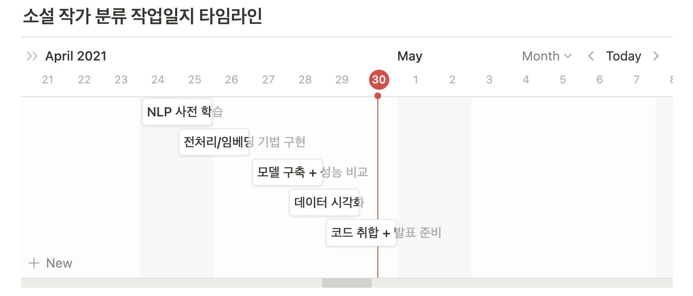

# 데이콘 소설 작가 분류 AI 경진대회

## 프로젝트 목표
- [DACON 소설 작가 분류 AI](https://dacon.io/competitions/official/235670/overview/description/)에서 진행된 대회를 바탕으로 진행하였다.
- 소설 속의 문장들을 분석하여 소설 작가를 예측하는 알고리즘 개발을 목표로 하였다.

## 팀원 
- [Wonkwon Lee](https://github.com/wonkwonlee), [Heewon Kwak](https://github.com/HeewonKwak), Woomi Sun, Hyewon Jung

## 프로젝트 타임라인

## Submmission
- [Final PPT](https://github.com/billkim418/Novel-Writing-Classification.with_NLP/blob/main/submission/nlp_writing_style_presentation.pdf)

